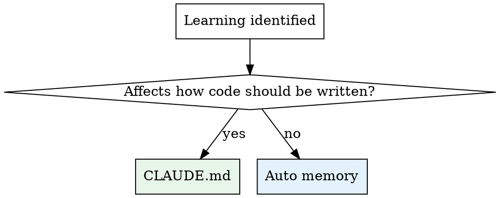

# Learnings

## Overview

Persist project-specific insights from the current conversation into two targets:
**CLAUDE.md** (team-facing, committed) and **auto memory files** (Claude's working
notes, personal). If `$ARGUMENTS` is provided, use it to guide extraction focus.

## Routing



| Target | What goes here | Examples |
|--------|---------------|----------|
| **CLAUDE.md** | Team rules that affect how code is written | Conventions, arch constraints, build/deploy commands, test patterns, API contracts |
| **Auto memory** | Context that helps Claude work effectively | Debugging insights ("error X means Y"), dep quirks, workarounds, decision rationale |

## Process

### 1. Extract candidates

Scan the conversation for project-specific learnings: codebase patterns, architectural
decisions, build/deploy gotchas, debugging insights, dependency behaviour.

**Filter ruthlessly.** Drop general programming knowledge, anything already captured,
and anything unlikely to matter in a future session.

### 2. Read existing state

Read the project CLAUDE.md (check repo root and relevant subdirectories).
Read MEMORY.md and any topic files in the auto memory directory relevant to the
new learnings.

### 3. Deduplicate

For each candidate, compare on **meaning not phrasing** against existing content.
Classify as:
- **New** — not covered anywhere
- **Duplicate** — skip
- **Supersedes** — replaces an outdated entry
- **Extends** — adds detail to an existing entry

Only New, Supersedes, and Extends proceed.

### 4. Present the plan

Show a diff-style summary before writing anything:

```
### CLAUDE.md
- [NEW] section → what will be added
- [SUPERSEDES] section → old → new

### Auto memory
- [NEW] filename.md → what will be added
- [EXTENDS] filename.md → what gets merged

### Skipped
- learning — reason (duplicate / too generic)
```

### 5. Confirm, then write

Wait for explicit approval. Then apply changes following the rules below.

## Writing Rules

### CLAUDE.md
- Keep under 150 lines total
- Concise bullets, not prose
- Merge into existing sections where possible
- Don't duplicate what's in auto memory

### Auto memory
- Follow the system's auto memory instructions (frontmatter format, MEMORY.md index)
- Descriptive topic filenames: `debugging-auth.md`, `api-quirks.md`
- Merge into existing topic files when subjects overlap
- Each topic file under 50 lines
- Date time-sensitive learnings (workarounds, known bugs)
- Entries must make sense in isolation

## Common Mistakes

| Mistake | Fix |
|---------|-----|
| Saving general knowledge ("use async/await for promises") | Only project-specific insights |
| Duplicating between CLAUDE.md and memory | Pick one target per learning |
| Writing prose paragraphs in CLAUDE.md | Terse bullets that scan fast |
| Saving ephemeral state ("currently debugging X") | Only durable insights |
| Skipping deduplication | Always read existing state first |
