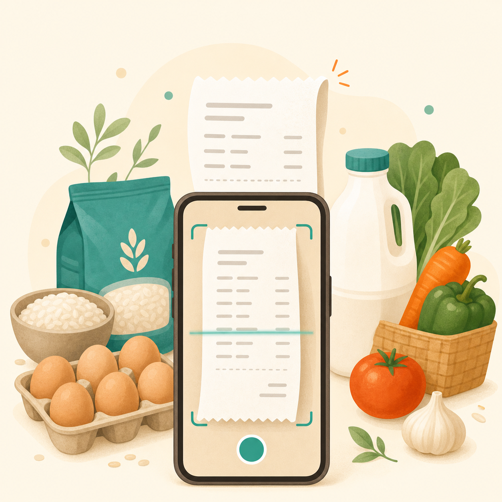
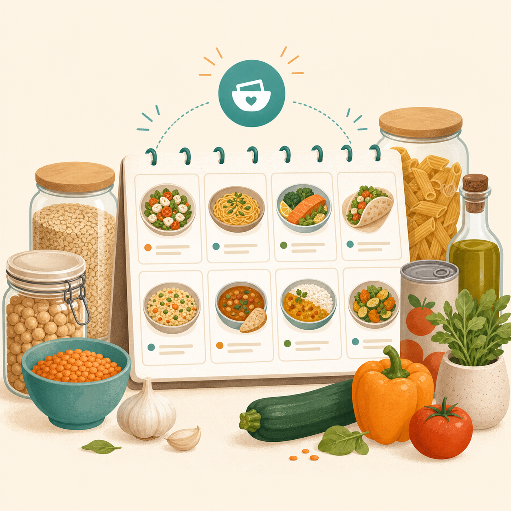
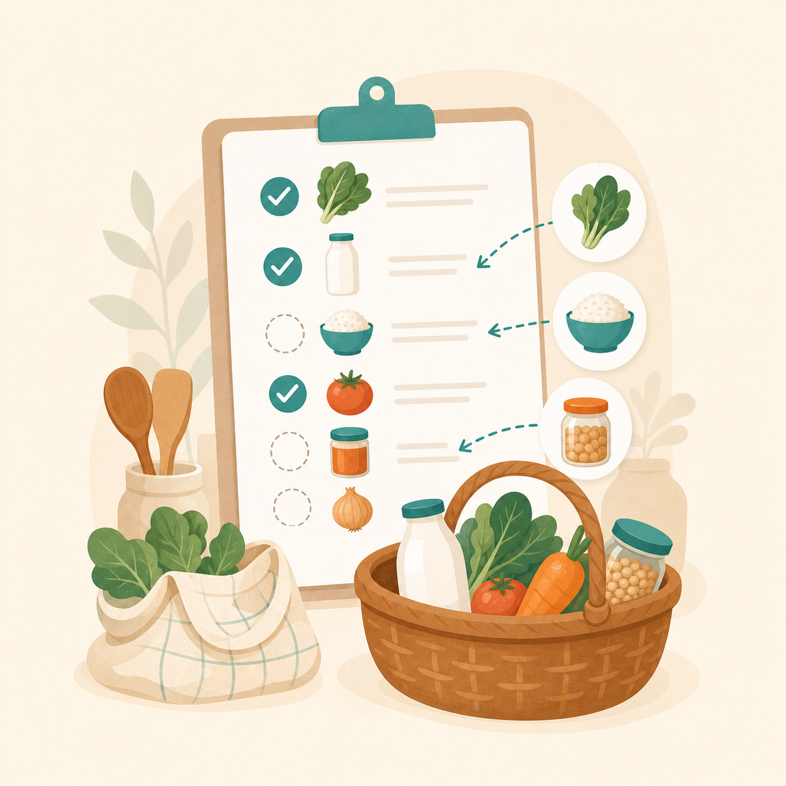

# Glean

Glean turns the food you already have into dinners you can actually make.
Scan a receipt or describe what is in the kitchen to stock your pantry, plan
your week around those ingredients, then shop only for the gaps.

Stop starting from scratch before every food shop. Glean gives you one calm
place to answer three everyday questions: what do I have, what can I cook, and
what do I need to buy?

## Stock Your Pantry. Plan Your Week. Shop The Gaps.

| Scan | Plan | Shop |
| --- | --- | --- |
|  |  |  |
| Scan receipts or describe food to stock your pantry. | Plan dinners around what you already have at home. | Let missing ingredients become your shopping list. |

## What It Does

- **Stock your pantry fast:** parse a receipt scan or natural-language food
  description into reviewable pantry items.
- **Know what you have:** track quantities, categories, and expiry dates.
- **Find meals worth cooking:** search or import recipes, then save the ones worth
  cooking again.
- **Plan around your kitchen:** build a weekly dinner plan from saved recipes and pantry
  context.
- **Shop with purpose:** add missing ingredients to the shopping list and check
  them off when they enter the pantry.

Ready to try it locally? Set up the backend and mobile app below, then stock
your pantry from the first receipt.

## Project Layout

```text
backend/   FastAPI backend, managed with uv, deployed with Mangum on AWS Lambda
mobile/    Expo / React Native app, managed with npm
Makefile   Common setup, test, lint, and dev-server commands
```

The mobile app is local-first: pantry, recipes, meal plans, and shopping state
live on device in SQLite. The backend stays stateless and handles AI-assisted
receipt parsing, recipe import, meal suggestions, auth validation, and rate
limiting.

## Architecture

```text
Expo app
  ├─ SQLite local state: pantry, recipes, plan, shopping list
  ├─ Expo Router tabs: Pantry, Meals, Plan, Shop, Settings
  └─ Native device flows: camera, auth callback, local persistence

FastAPI backend
  ├─ Receipt and text parsing
  ├─ Recipe search/import
  ├─ Meal suggestions
  └─ Cognito/JWT validation and rate limiting
```

The intended product contract is review-before-write: AI can propose pantry or
shopping items, but users confirm the result before local state changes.

## Prerequisites

- Docker Desktop
- Python 3.14+
- uv
- Node.js 18+
- Expo Go on your phone for physical-device testing

## Setup

Install backend and mobile dependencies:

```bash
make setup
```

Create backend environment variables:

```bash
cp backend/.env.example backend/.env
```

Fill in real API keys in `backend/.env` when using endpoints that call external services.

## Run Locally

Start the backend without Docker:

```bash
make start-backend
```

Start the backend with the production Docker image:

```bash
make start-backend-docker
```

Start Expo:

```bash
make start-mobile
```

The default mobile API URL is `http://localhost:8000`, which works for iOS Simulator and Android Emulator.

## Test on a Phone Over Wi-Fi

A physical phone cannot reach your laptop's `localhost`. Start the Dockerized backend, find your laptop's Wi-Fi IP, then pass it to the existing mobile start command through `API_HOST`.

```bash
make start-backend-docker
ipconfig getifaddr en0
make start-mobile API_HOST=192.168.4.51
```

Scan the Expo QR code with Expo Go. Your phone and laptop must be on the same Wi-Fi network.

If your IP changes, rerun:

```bash
ipconfig getifaddr en0
```

Then restart Expo with the new `API_HOST`.

## Useful Commands

```bash
make test          # backend and mobile tests
make lint          # backend and mobile lint/type checks
make pre-commit    # all configured pre-commit hooks
make help          # list Make targets
```
